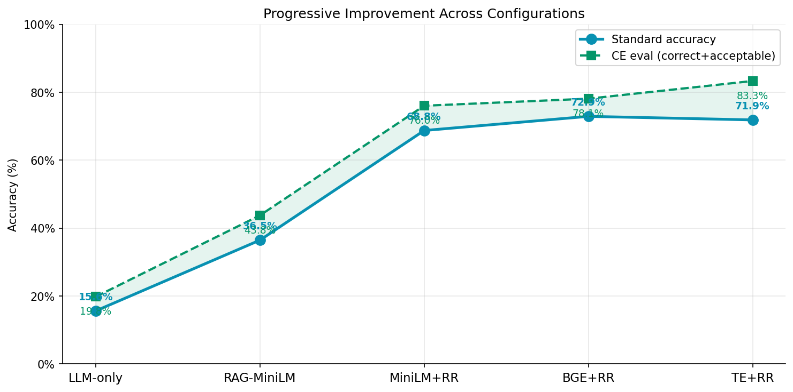
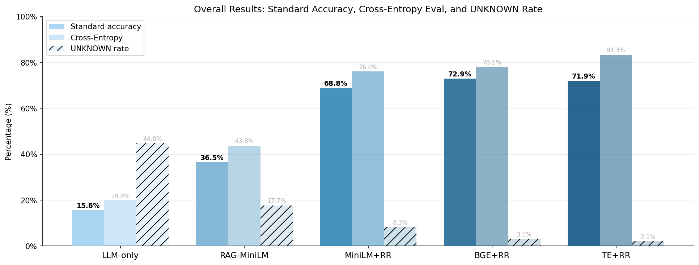
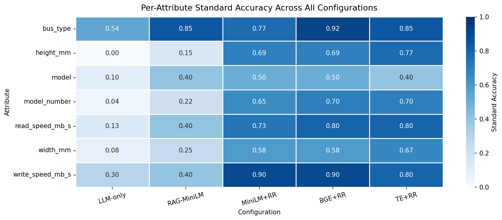
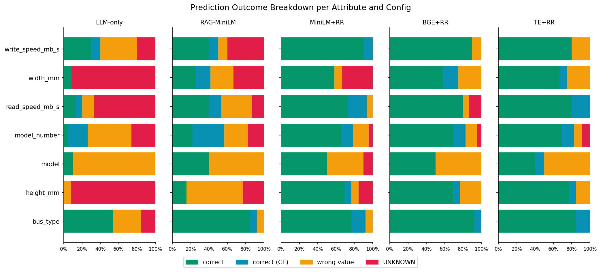
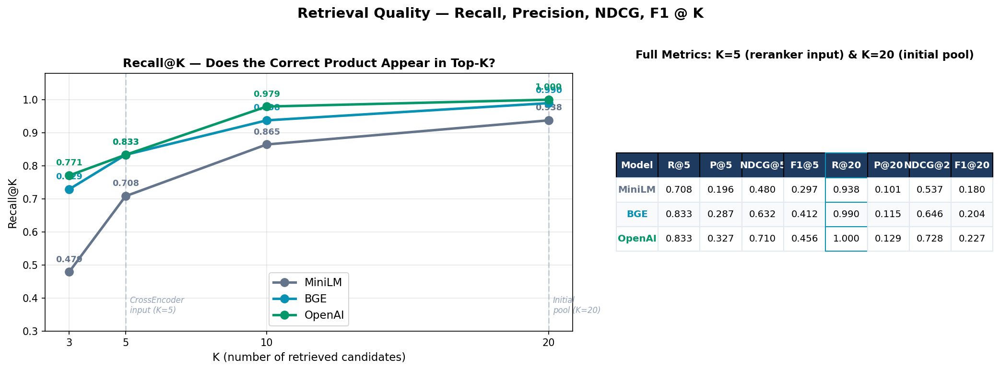
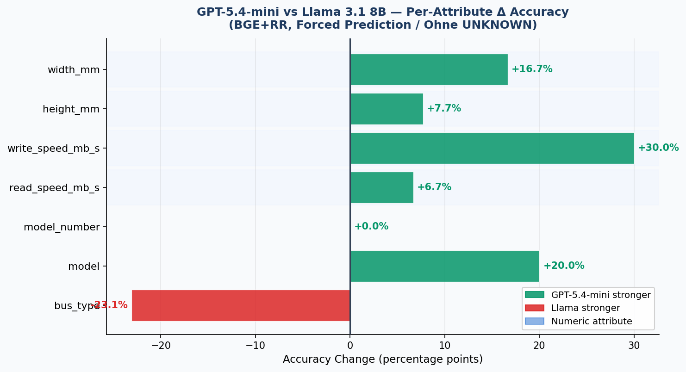

# RAG-Driven Data Cleaning with PyDI

**CS 715 - Solving Complex Tasks with Large Language Models**  
University of Mannheim, FSS 2026 | Marmee Pandya

---

## Overview

Product datasets have a fundamental missing-value problem that LLMs alone cannot solve. An attribute like `model_number: V375-040R` or `read_speed_mb_s: 3480.0` does not appear anywhere in a product description. It exists only as a structured field in another retailer's listing of the same product. No amount of prompt engineering gets you there without a lookup.

This project builds a retrieval-augmented generation (RAG) pipeline that fills missing product attribute values by finding similar products in a knowledge base and extracting the correct value from the retrieved context. It is implemented as a `RAGCleaner` component inside [PyDI](https://github.com/wbsg-uni-mannheim/PyDI), the Python Data Integration framework from the University of Mannheim, making it a composable drop-in for any PyDI pipeline.

The setup follows RetClean's Scenario 3 (Naeem et al., VLDB 2024): local LLM inference via Ollama, local retrieval, no data sent to external services. Seven configurations are evaluated systematically, each isolating one variable: embedding model, reranker, prediction LLM, and a data fusion step.

---

## Problem Setup

**Dataset:** Four product offer datasets from [WDC Products](https://webdatacommons.org/largescaleproductcorpus/) covering GPUs, SSDs, HDDs, and USB drives. Dataset 1 (812 rows) is the query set to clean; Datasets 2-4 (~2,200 rows combined) form the knowledge base. Products are linked across datasets by `cluster_id`.

**Evaluation set:** 96 tasks across 50 query products, one task per (product, missing attribute) pair. Every task was verified to have its ground truth present verbatim in the KB, so failures are always retrieval or extraction errors rather than KB gaps.

**Target attributes** span a deliberate range of difficulty:

| Attribute | Type | Tasks | LLM without retrieval |
|---|---|---|---|
| `bus_type` | text | 13 | Easy: standard vocabulary |
| `model` | text | 10 | Medium: sometimes in descriptions |
| `model_number` | text | 23 | Hard: exact SKU, unguessable |
| `read_speed_mb_s` | numeric | 15 | Impossible without KB |
| `write_speed_mb_s` | numeric | 10 | Impossible without KB |
| `height_mm` | numeric | 13 | Impossible without KB |
| `width_mm` | numeric | 12 | Impossible without KB |

**Metrics:**
- *Standard accuracy*: substring match for text attributes, exact match for numeric (all KB values for the same cluster were verified to be identical across datasets, so no tolerance window is needed)
- *CE eval*: CrossEncoder (`ms-marco-MiniLM-L-6-v2`) scores prediction vs ground truth, removing the self-evaluation bias that would arise from using the same LLM as judge
- *UNKNOWN rate*: fraction of tasks where the model declined to predict, reported separately since accuracy and abstention must be read together

---

## System Design

Each configuration is a pipeline of up to three stages:

```
Query Product
    |
    v
[Bi-encoder] cosine similarity --> top-20 KB candidates
    |
    v
[CrossEncoder] pairwise reranking --> top-5
    |
    v
[LLM] match-then-extract prompt --> predicted value
```

The LLM prompt follows a match-then-extract structure: the model first identifies the best matching reference product among the candidates, then copies the attribute value exactly. Where no confident match exists, it returns `VALUE:UNKNOWN`. Each of the seven target attributes has its own few-shot prompt with explicit field-confusion warnings (for example, the `write_speed_mb_s` prompt explicitly cautions against returning the read speed).

**Embedding models compared:**
- `all-MiniLM-L6-v2`: 384-dim, 22M params, fast baseline
- `BAAI/bge-large-en-v1.5`: 1024-dim, 335M params, top MTEB retrieval model
- OpenAI `text-embedding-3-large`: 3072-dim API model *(sends product text externally, breaking Scenario 3)*

**Reranker:** `cross-encoder/ms-marco-MiniLM-L-6-v2` applied over top-20, producing top-5.

**Prediction LLMs:** Llama 3.1 8B Instruct (local via Ollama, `temperature=0`, `seed=42`) and GPT-4o-mini / GPT-5.4-mini via OpenAI API.

**Exp 7 - PyDI fusion:** Rather than passing 5 raw KB rows to the LLM, PyDI's `DataFusionEngine` first consolidates them into a single record using attribute-specific strategies (majority vote for text attributes, median for numeric, longest string for model numbers). The LLM then extracts from one clean record instead of noisy duplicates.

---

## Results

### Progression across Llama configurations



The steepest gain is at the reranking step, not the retrieval step. Adding CrossEncoder reranking on top of MiniLM retrieval (+32 points, from 36.5% to 68.8%) is roughly four times larger than upgrading the embedding model from MiniLM to BGE or OpenAI (+2-4 points).

### Overall results (UNKNOWN permitted)



| Configuration | Accuracy | UNKNOWN |
|---|---|---|
| Exp 1 - LLM-only (Llama) | 15.6% | 44.8% |
| Exp 2 - RAG + MiniLM | 36.5% | 17.7% |
| Exp 3 - MiniLM + Reranker | 68.8% | 8.3% |
| Exp 4 - BGE + Reranker | 72.9% | 3.1% |
| Exp 5 - TE + Reranker | **71.9%** | 2.1% |
| Exp 6 - BGE + RR + GPT-4o-mini | 64.6% | 27.1% |
| Exp 6 - BGE + RR + GPT-5.4-mini | 60.4% | 34.4% |
| Exp 7 - TE + RR + PyDI fusion | 62.5% | 1.0% |
| Exp 7 - TE + RR + GPT-4o-mini | 65.6% | 22.9% |
| Exp 7 - TE + RR + GPT-5.4-mini | 63.5% | 27.1% |

### Forced prediction (UNKNOWN disallowed)

| Configuration | Accuracy |
|---|---|
| Exp 1 - LLM-only | 13.5% |
| Exp 2 - RAG + MiniLM | 37.5% |
| Exp 3 - MiniLM + Reranker | 66.7% |
| Exp 4 - BGE + Reranker | 69.8% |
| Exp 5 - TE + Reranker | 70.8% |
| Exp 6 - BGE + RR + GPT-4o-mini | 75.0% |
| Exp 6 - BGE + RR + GPT-5.4-mini | 76.0% |
| Exp 7 - TE + RR + GPT-4o-mini | 75.0% |
| Exp 7 - TE + RR + GPT-5.4-mini | **77.1%** |

### Per-attribute breakdown



`height_mm` starts at 0.00 under LLM-only (no signal anywhere in product descriptions) and reaches 0.77 with TE+RR. `model_number` jumps from 0.22 to 0.65 at the reranking step, which is the exact result the CrossEncoder was designed for: separating near-identical SKUs that cosine similarity cannot distinguish.

### Outcome breakdown per attribute



### Retrieval quality



| Embedding model | Recall@5 | Recall@20 | NDCG@5 |
|---|---|---|---|
| MiniLM (384-dim) | 70.8% | 93.8% | 0.480 |
| BGE-large (1024-dim) | 83.3% | 99.0% | 0.632 |
| OpenAI TE-3-large (3072-dim) | 83.3% | **100%** | 0.710 |

MiniLM's 70.8% Recall@5 directly explains the Exp 2 vs Exp 3 gap: for roughly 30% of tasks the correct product never appears in the initial top-3, making recovery impossible regardless of LLM capability. OpenAI achieves perfect Recall@20 across all 96 tasks; BGE misses on roughly 1 in 100.

---

## Key Findings

**Re-ranking matters more than the embedding model.** Exp 2 to Exp 3 (adding CrossEncoder reranking, same MiniLM embedder) is a +32-point jump. Upgrading from MiniLM to BGE or OpenAI adds 2-4 points. Once the retrieval pool is wide enough, pairwise token-level scoring is what separates correct products from near-identical variants.

**Numeric attributes go from near-zero to competitive only with retrieval.** `height_mm` scores 0% under LLM-only since there is no signal in a product title for physical dimensions. With TE+RR it reaches 77%. This is the clearest case that retrieval is doing real work rather than amplifying something the LLM already knew.

**The GPT abstention gap is a calibration problem, not a capability gap.** Under permitted abstention, GPT-5.4-mini (BGE+RR) scores 60.4%, trailing every Llama config. Under forced prediction it scores 76.0%, matching the best Llama result. The uncertainty instruction was calibrated for Llama's decisive response style; GPT models treat it as permission to hedge on anything uncertain. The per-attribute delta under forced prediction is shown below.



GPT-5.4-mini gains +30 points on `write_speed_mb_s` and +16.7 on `width_mm`, confirming that instruction-following fidelity on numeric field extraction, not retrieval quality, is the remaining bottleneck for those attributes. `bus_type` is the one exception where Llama is stronger (-23.1%), likely because GPT hedges more on ambiguous interface version variants.

**PyDI fusion improves presentation quality but does not clear the retrieval ceiling.** The fused-record variant (Exp 7, Llama) has a much lower UNKNOWN rate (1.0%) and a smaller CE eval gap relative to standard accuracy, suggesting fusion helps the LLM read candidates more cleanly. Standard accuracy stays below the manual approach because fusion cannot compensate when the CrossEncoder surfaces the wrong near-duplicate in the first place.

**About 30% of failures are dataset quality issues.** Ground truth values like `ISS` or `220S` are internal codes that do not match how any retrieved product describes itself. These are annotation inconsistencies that no retrieval or extraction improvement can fix.

**Fully privacy-preserving configuration:** BGE + CrossEncoder + Llama (Exp 4) at 76.0%. OpenAI embeddings and GPT models both send product data to external APIs.

---

## References

- Naeem, Z. A., Ahmad, M. S., Eltabakh, M., Ouzzani, M., and Tang, N. (2024). RetClean: Retrieval-Based Data Cleaning Using LLMs and Data Lakes. *PVLDB*, 17(12), 4421-4424.
- Lewis, P., Perez, E., Piktus, A., et al. (2020). Retrieval-Augmented Generation for Knowledge-Intensive NLP Tasks. *NeurIPS 33*, 9459-9474.
- Xiao, S., Liu, Z., Zhang, P., and Muennighoff, N. (2023). C-Pack: Packaged Resources to Advance General Chinese Embedding. *arXiv:2309.07597*.
- Narayan, A., Chami, I., Orr, L., Arora, S., and Re, C. (2022). Can Foundation Models Wrangle Your Data? *PVLDB*, 16(4), 738-746.
- Reimers, N. and Gurevych, I. (2019). Sentence-BERT: Sentence Embeddings using Siamese BERT-Networks. *EMNLP 2019*, 3982-3992.
- Nogueira, R. and Cho, K. (2019). Passage Re-ranking with BERT. *arXiv:1901.04085*.
- Muennighoff, N., Tazi, N., Magne, L., and Reimers, N. (2023). MTEB: Massive Text Embedding Benchmark. *EACL 2023*, 2014-2037.
- Karpukhin, V., Oguz, B., Min, S., et al. (2020). Dense Passage Retrieval for Open-Domain Question Answering. *EMNLP 2020*, 6769-6781.
- Peeters, R. and Bizer, C. (2023). Using ChatGPT for Entity Matching. *ADBIS 2023*, 221-230.
- Dubey, A., et al. (2024). The Llama 3 Herd of Models. *arXiv:2407.21783*.
- Khattab, O. and Zaharia, M. (2020). ColBERT: Efficient and Effective Passage Search via Contextualized Late Interaction over BERT. *SIGIR 2020*, 39-48.
- Izacard, G. and Grave, E. (2021). Leveraging Passage Retrieval with Generative Models for Open Domain Question Answering. *EACL 2021*, 874-880.
- Rahm, E. and Do, H. H. (2000). Data Cleaning: Problems and Current Approaches. *IEEE Data Eng. Bulletin*, 23(4), 3-13.
- Thakur, N., Reimers, N., Ruckle, A., Srivastava, A., and Gurevych, I. (2021). BEIR: A Heterogeneous Benchmark for Zero-shot Evaluation of Information Retrieval Models. *NeurIPS Datasets and Benchmarks*.
- Gao, Y., Xiong, Y., Gao, X., et al. (2023). Retrieval-Augmented Generation for Large Language Models: A Survey. *arXiv:2312.10997*.
